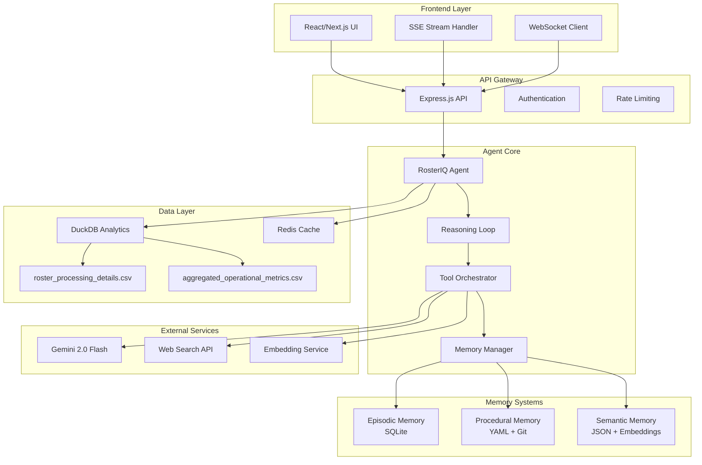
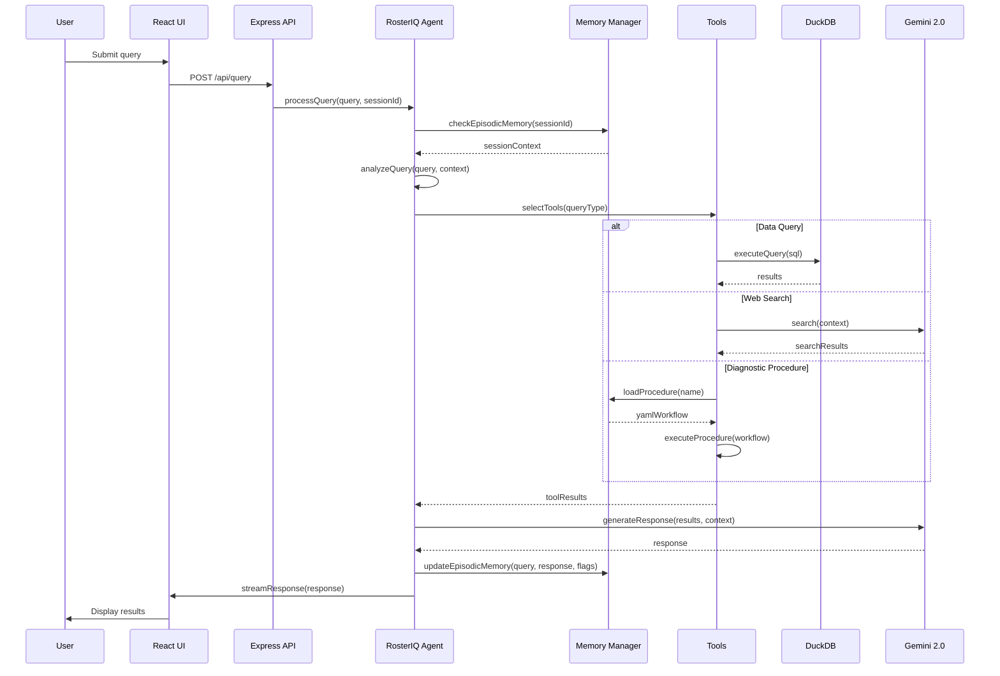
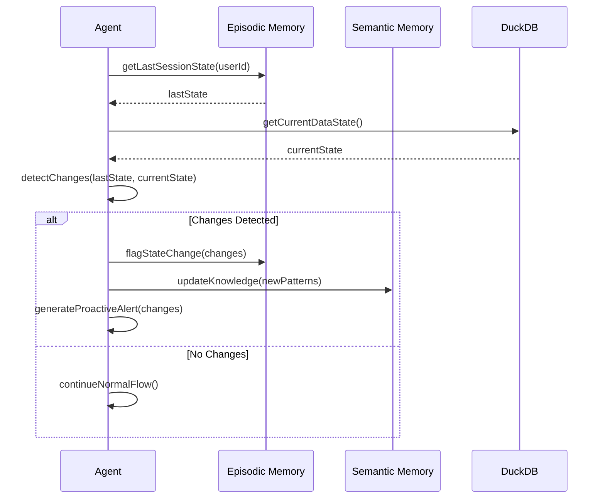

# Design Document: RosterIQ AI Agent

## Overview

RosterIQ is an autonomous AI agent system designed for healthcare insurance payers to analyze provider roster pipeline operations with intelligent persistent memory capabilities. The system processes two CSV datasets (file-level pipeline data and market-level metrics) and provides comprehensive analysis through three distinct memory architectures: episodic (session history), procedural (diagnostic workflows), and semantic (domain knowledge). Built on Node.js/TypeScript with SQLite/DuckDB backends and Gemini 2.0 Flash AI integration, RosterIQ delivers real-time streaming analytics with proactive monitoring and evidence-based insights for operational teams.

The system distinguishes between pipeline errors (FAIL_REC_CNT) and data quality issues (REJ_REC_CNT), providing actionable intelligence through natural language queries, cross-dataset correlation analysis, and four named diagnostic procedures. With session continuity, live procedure improvement, and comprehensive source attribution, RosterIQ transforms healthcare roster operations from reactive troubleshooting to proactive intelligence-driven management.

## Architecture



## Sequence Diagrams

### Main Query Processing Flow



### Memory State Change Detection



## Components and Interfaces

### Component 1: RosterIQ Agent Core

**Purpose**: Central autonomous reasoning engine that orchestrates all system operations

**Interface**:
```typescript
interface RosterIQAgent {
  processQuery(query: string, sessionId: string): Promise<AgentResponse>
  startReasoningLoop(): Promise<void>
  executeStep(step: ReasoningStep): Promise<StepResult>
  generateProactiveAlert(changes: StateChange[]): Promise<Alert>
  improveWorkflow(procedureName: string, feedback: string): Promise<void>
}

interface AgentResponse {
  response: string
  sources: Source[]
  confidence: number
  reasoning: ReasoningStep[]
  flags: Flag[]
  visualizations?: Visualization[]
}

interface ReasoningStep {
  id: string
  type: 'analyze' | 'query' | 'search' | 'correlate' | 'conclude'
  description: string
  toolsUsed: string[]
  evidence: Evidence[]
  timestamp: Date
}
```

**Responsibilities**:
- Query interpretation and intent classification
- Tool selection and orchestration
- Evidence synthesis and response generation
- Memory integration and state management
- Proactive monitoring and alerting

### Component 2: Memory Manager

**Purpose**: Manages three types of persistent memory with intelligent retrieval and updates

**Interface**:
```typescript
interface MemoryManager {
  // Episodic Memory
  getSessionHistory(sessionId: string): Promise<SessionHistory>
  updateEpisodicMemory(entry: EpisodicEntry): Promise<void>
  detectStateChanges(sessionId: string): Promise<StateChange[]>
  
  // Procedural Memory
  loadProcedure(name: string): Promise<DiagnosticProcedure>
  saveProcedure(procedure: DiagnosticProcedure): Promise<void>
  versionProcedure(name: string, changes: string): Promise<string>
  
  // Semantic Memory
  queryKnowledge(query: string): Promise<KnowledgeResult[]>
  updateKnowledge(facts: Fact[]): Promise<void>
  generateEmbeddings(text: string): Promise<number[]>
}

interface EpisodicEntry {
  sessionId: string
  timestamp: Date
  query: string
  response: string
  flags: Flag[]
  dataState: DataStateSnapshot
  toolsUsed: string[]
}

interface DiagnosticProcedure {
  name: string
  version: string
  description: string
  steps: ProcedureStep[]
  parameters: Parameter[]
  expectedOutputs: OutputSpec[]
}
```

**Responsibilities**:
- Session continuity and history tracking
- Diagnostic workflow management and versioning
- Domain knowledge base maintenance
- State change detection and flagging
- Memory retrieval optimization

### Component 3: Tool Orchestrator

**Purpose**: Manages and coordinates execution of specialized analysis tools

**Interface**:
```typescript
interface ToolOrchestrator {
  executeDataQuery(query: DataQuery): Promise<QueryResult>
  performWebSearch(context: SearchContext): Promise<SearchResult[]>
  detectAnomalies(dataset: string, metrics: string[]): Promise<Anomaly[]>
  generateVisualization(spec: VisualizationSpec): Promise<Visualization>
  correlateCrossDataset(query1: string, query2: string): Promise<CorrelationResult>
}

interface DataQuery {
  sql: string
  dataset: 'roster_processing' | 'operational_metrics' | 'cross_dataset'
  parameters: Record<string, any>
  cacheKey?: string
}

interface SearchContext {
  query: string
  domain: 'healthcare' | 'regulatory' | 'operational'
  timeframe?: DateRange
  sources?: string[]
}

interface VisualizationSpec {
  type: 'trend' | 'correlation' | 'distribution' | 'heatmap' | 'sankey' | 'scatter' | 'bar' | 'timeline'
  data: any[]
  config: ChartConfig
  sources: Source[]
}
```

**Responsibilities**:
- SQL query execution and optimization
- Web search integration and context filtering
- Anomaly detection across datasets
- Visualization generation with source attribution
- Cross-dataset correlation analysis
### Component 4: Data Analytics Engine

**Purpose**: High-performance data processing and analysis using DuckDB

**Interface**:
```typescript
interface DataAnalyticsEngine {
  initializeDatasets(): Promise<void>
  executeQuery(sql: string, params?: any[]): Promise<QueryResult>
  getDatasetSchema(dataset: string): Promise<Schema>
  createView(name: string, query: string): Promise<void>
  optimizeQuery(sql: string): Promise<string>
  getQueryPlan(sql: string): Promise<QueryPlan>
}

interface QueryResult {
  rows: Record<string, any>[]
  columns: ColumnInfo[]
  executionTime: number
  rowCount: number
  sources: DataSource[]
}

interface Schema {
  tables: TableInfo[]
  relationships: Relationship[]
  indexes: IndexInfo[]
}
```

**Responsibilities**:
- CSV data ingestion and schema inference
- High-performance analytical query execution
- Query optimization and caching
- Cross-dataset join operations
- Data quality validation

## Data Models

### Core Domain Models

```typescript
interface RosterProcessingRecord {
  file_id: string
  submission_date: Date
  market_segment: string
  provider_type: string
  total_records: number
  processed_records: number
  failed_records: number  // FAIL_REC_CNT - pipeline errors
  rejected_records: number  // REJ_REC_CNT - data quality issues
  processing_stage: 'intake' | 'validation' | 'transformation' | 'loading' | 'complete'
  error_codes: string[]
  processing_time_minutes: number
  retry_count: number
  final_status: 'success' | 'failed' | 'partial'
}

interface OperationalMetrics {
  market_id: string
  month: string
  total_files_received: number
  files_processed_successfully: number
  average_processing_time: number
  error_rate_percentage: number
  top_error_categories: string[]
  provider_onboarding_rate: number
  data_quality_score: number
  sla_compliance_percentage: number
}

interface SessionState {
  sessionId: string
  userId: string
  startTime: Date
  lastActivity: Date
  queryCount: number
  flags: Flag[]
  dataStateSnapshot: DataStateSnapshot
  activeContext: string[]
}

interface Flag {
  id: string
  type: 'alert' | 'warning' | 'info' | 'success'
  category: 'data_quality' | 'performance' | 'anomaly' | 'regulatory'
  message: string
  severity: 1 | 2 | 3 | 4 | 5
  timestamp: Date
  resolved: boolean
  source: string
}
```

**Validation Rules**:
- file_id must be unique and follow naming convention
- failed_records + rejected_records ≤ total_records
- processing_time_minutes must be positive
- error_rate_percentage must be between 0 and 100
- All dates must be valid and within reasonable ranges

### Memory Models

```typescript
interface EpisodicMemory {
  entries: EpisodicEntry[]
  sessionIndex: Map<string, EpisodicEntry[]>
  flagIndex: Map<string, Flag[]>
  stateChangeLog: StateChange[]
}

interface ProceduralMemory {
  procedures: Map<string, DiagnosticProcedure>
  versions: Map<string, ProcedureVersion[]>
  executionHistory: ProcedureExecution[]
  improvementLog: ProcedureImprovement[]
}

interface SemanticMemory {
  knowledgeBase: KnowledgeFact[]
  embeddings: Map<string, number[]>
  conceptGraph: ConceptNode[]
  domainOntology: OntologyEntry[]
}

interface KnowledgeFact {
  id: string
  content: string
  category: 'regulatory' | 'operational' | 'technical' | 'business'
  confidence: number
  sources: Source[]
  lastUpdated: Date
  embedding: number[]
}
```

## Algorithmic Pseudocode

### Main Agent Reasoning Loop

```pascal
ALGORITHM processQuery(query, sessionId)
INPUT: query of type String, sessionId of type String
OUTPUT: response of type AgentResponse

PRECONDITIONS:
  - query is non-empty string
  - sessionId is valid UUID format
  - Memory systems are initialized
  - Data connections are established

BEGIN
  // Step 1: Load session context and detect changes
  sessionContext ← memoryManager.getSessionHistory(sessionId)
  stateChanges ← memoryManager.detectStateChanges(sessionId)
  
  IF stateChanges.length > 0 THEN
    contextualInfo ← generateStateChangeContext(stateChanges)
    query ← enrichQueryWithContext(query, contextualInfo)
  END IF
  
  // Step 2: Analyze query and determine reasoning path
  queryIntent ← classifyIntent(query)
  requiredTools ← selectTools(queryIntent, sessionContext)
  reasoningSteps ← planReasoningSequence(queryIntent, requiredTools)
  
  // Step 3: Execute reasoning loop with evidence collection
  evidence ← []
  FOR each step IN reasoningSteps DO
    ASSERT step.isValid() AND step.hasRequiredInputs()
    
    stepResult ← executeReasoningStep(step, evidence)
    evidence.append(stepResult.evidence)
    
    // Update confidence based on evidence quality
    IF stepResult.confidence < CONFIDENCE_THRESHOLD THEN
      additionalSteps ← generateClarificationSteps(step, evidence)
      reasoningSteps.extend(additionalSteps)
    END IF
  END FOR
  
  // Step 4: Synthesize response with source attribution
  response ← synthesizeResponse(evidence, query, sessionContext)
  response.sources ← extractSources(evidence)
  response.confidence ← calculateOverallConfidence(evidence)
  
  // Step 5: Update episodic memory and generate flags
  episodicEntry ← createEpisodicEntry(query, response, sessionId)
  newFlags ← detectNewFlags(response, evidence, sessionContext)
  memoryManager.updateEpisodicMemory(episodicEntry)
  
  ASSERT response.isComplete() AND response.hasSourceAttribution()
  
  RETURN response
END

POSTCONDITIONS:
  - Response contains evidence-based analysis
  - All data points have source attribution
  - Episodic memory is updated with session state
  - New flags are generated if anomalies detected
  - Response confidence is calculated and validated

LOOP INVARIANTS:
  - Evidence collection maintains source traceability
  - Confidence scores remain within valid range [0,1]
  - Memory consistency is preserved throughout execution
```

### Cross-Dataset Correlation Analysis

```pascal
ALGORITHM correlateCrossDataset(query1, query2, correlationParams)
INPUT: query1, query2 of type String, correlationParams of type CorrelationConfig
OUTPUT: correlation of type CorrelationResult

PRECONDITIONS:
  - Both queries are valid SQL statements
  - Correlation parameters specify valid metrics and time windows
  - Both datasets are accessible and loaded

BEGIN
  // Step 1: Execute queries on respective datasets
  dataset1Results ← dataEngine.executeQuery(query1, 'roster_processing')
  dataset2Results ← dataEngine.executeQuery(query2, 'operational_metrics')
  
  ASSERT dataset1Results.rowCount > 0 AND dataset2Results.rowCount > 0
  
  // Step 2: Align datasets by common dimensions
  commonDimensions ← findCommonDimensions(dataset1Results, dataset2Results)
  alignedData ← alignDatasetsByDimensions(dataset1Results, dataset2Results, commonDimensions)
  
  // Step 3: Calculate correlation metrics
  correlationMatrix ← calculateCorrelationMatrix(alignedData, correlationParams.metrics)
  statisticalSignificance ← calculateSignificance(correlationMatrix, alignedData.sampleSize)
  
  // Step 4: Identify patterns and anomalies
  patterns ← []
  FOR each correlation IN correlationMatrix DO
    IF ABS(correlation.coefficient) > correlationParams.threshold THEN
      pattern ← analyzeCorrelationPattern(correlation, alignedData)
      patterns.append(pattern)
    END IF
  END FOR
  
  // Step 5: Generate insights with confidence scoring
  insights ← generateCorrelationInsights(patterns, statisticalSignificance)
  confidenceScore ← calculateInsightConfidence(insights, alignedData.quality)
  
  result ← CorrelationResult{
    correlations: correlationMatrix,
    patterns: patterns,
    insights: insights,
    confidence: confidenceScore,
    sources: [dataset1Results.sources, dataset2Results.sources],
    methodology: correlationParams
  }
  
  ASSERT result.isStatisticallyValid() AND result.hasSourceAttribution()
  
  RETURN result
END

POSTCONDITIONS:
  - Correlation coefficients are within valid range [-1, 1]
  - Statistical significance is properly calculated
  - All insights have confidence scores and source attribution
  - Result includes methodology for reproducibility

LOOP INVARIANTS:
  - Data alignment preserves referential integrity
  - Correlation calculations maintain mathematical validity
  - Source attribution is preserved through all transformations
```

### Diagnostic Procedure Execution

```pascal
ALGORITHM executeDiagnosticProcedure(procedureName, parameters)
INPUT: procedureName of type String, parameters of type Map<String, Any>
OUTPUT: diagnosticResult of type DiagnosticResult

PRECONDITIONS:
  - Procedure exists in procedural memory
  - All required parameters are provided and valid
  - Data access permissions are verified

BEGIN
  // Step 1: Load and validate procedure
  procedure ← proceduralMemory.loadProcedure(procedureName)
  ASSERT procedure ≠ null AND procedure.isValid()
  
  validationResult ← validateParameters(parameters, procedure.parameterSpec)
  IF NOT validationResult.isValid THEN
    RETURN DiagnosticResult.error(validationResult.errors)
  END IF
  
  // Step 2: Initialize execution context
  executionContext ← ProcedureExecutionContext{
    procedure: procedure,
    parameters: parameters,
    startTime: now(),
    evidence: [],
    intermediateResults: []
  }
  
  // Step 3: Execute procedure steps with error handling
  FOR each step IN procedure.steps DO
    ASSERT step.preconditions.areMetBy(executionContext)
    
    TRY
      stepResult ← executeStep(step, executionContext)
      executionContext.intermediateResults.append(stepResult)
      executionContext.evidence.extend(stepResult.evidence)
      
      // Validate step postconditions
      IF NOT step.postconditions.areMetBy(stepResult) THEN
        RETURN DiagnosticResult.error("Step postcondition failed: " + step.name)
      END IF
      
    CATCH exception
      errorResult ← handleStepError(step, exception, executionContext)
      IF errorResult.isFatal THEN
        RETURN DiagnosticResult.error(errorResult.message)
      ELSE
        // Continue with degraded functionality
        executionContext.warnings.append(errorResult.warning)
      END IF
    END TRY
  END FOR
  
  // Step 4: Synthesize final diagnostic result
  finalResult ← synthesizeDiagnosticResult(executionContext)
  finalResult.executionTime ← now() - executionContext.startTime
  finalResult.procedureVersion ← procedure.version
  
  // Step 5: Update procedural memory with execution history
  executionRecord ← ProcedureExecution{
    procedureName: procedureName,
    parameters: parameters,
    result: finalResult,
    executionTime: finalResult.executionTime,
    timestamp: now()
  }
  proceduralMemory.recordExecution(executionRecord)
  
  ASSERT finalResult.isComplete() AND finalResult.hasEvidence()
  
  RETURN finalResult
END

POSTCONDITIONS:
  - Diagnostic result contains comprehensive analysis
  - All evidence is properly attributed and timestamped
  - Execution history is recorded for future improvement
  - Result confidence is calculated based on evidence quality

LOOP INVARIANTS:
  - Execution context maintains consistency throughout procedure
  - Evidence collection preserves source traceability
  - Error handling maintains system stability
```

## Key Functions with Formal Specifications

### Function 1: detectStateChanges()

```typescript
function detectStateChanges(sessionId: string): Promise<StateChange[]>
```

**Preconditions:**
- `sessionId` is valid UUID format
- Session exists in episodic memory
- Data connections are established and accessible

**Postconditions:**
- Returns array of detected state changes
- Each change includes timestamp, type, and affected data
- Changes are ordered chronologically
- No duplicate changes in result set

**Loop Invariants:**
- Data integrity maintained during comparison operations
- Timestamp ordering preserved throughout detection process

### Function 2: generateProactiveAlert()

```typescript
function generateProactiveAlert(changes: StateChange[]): Promise<Alert>
```

**Preconditions:**
- `changes` array is non-empty and contains valid StateChange objects
- Each change has required fields: type, timestamp, affectedData
- Alert generation rules are loaded and accessible

**Postconditions:**
- Returns Alert object with appropriate severity and message
- Alert includes actionable recommendations
- Alert references specific data sources and changes
- Alert confidence score is calculated and within valid range [0,1]

**Loop Invariants:** N/A (no loops in this function)

### Function 3: improveWorkflow()

```typescript
function improveWorkflow(procedureName: string, feedback: string): Promise<void>
```

**Preconditions:**
- `procedureName` exists in procedural memory
- `feedback` is non-empty string with improvement suggestions
- User has appropriate permissions for workflow modification

**Postconditions:**
- Procedure is updated with improvements based on feedback
- New version is created and stored with version control
- Previous version remains accessible for rollback
- Improvement is logged with timestamp and user attribution

**Loop Invariants:**
- Version control integrity maintained throughout update process
- Procedure validation rules enforced for all modifications
## Example Usage

### Basic Query Processing

```typescript
// Example 1: Natural language query about roster operations
const agent = new RosterIQAgent()
const sessionId = "user-123-session-456"

const query = "What changed in our roster processing since my last session?"
const response = await agent.processQuery(query, sessionId)

console.log(response.response) // "Since your last session 3 days ago, I detected..."
console.log(response.sources) // Array of data sources with citations
console.log(response.flags)   // New alerts and warnings
```

### Cross-Dataset Correlation Analysis

```typescript
// Example 2: Correlating file-level errors with market metrics
const correlationQuery = {
  dataset1Query: `
    SELECT market_segment, AVG(failed_records) as avg_failures, 
           AVG(processing_time_minutes) as avg_time
    FROM roster_processing_details 
    WHERE submission_date >= '2024-01-01'
    GROUP BY market_segment
  `,
  dataset2Query: `
    SELECT market_id, AVG(error_rate_percentage) as market_error_rate,
           AVG(data_quality_score) as quality_score
    FROM aggregated_operational_metrics
    WHERE month >= '2024-01'
    GROUP BY market_id
  `,
  correlationParams: {
    metrics: ['avg_failures', 'market_error_rate'],
    threshold: 0.7,
    timeWindow: '3months'
  }
}

const correlation = await agent.toolOrchestrator.correlateCrossDataset(
  correlationQuery.dataset1Query,
  correlationQuery.dataset2Query,
  correlationQuery.correlationParams
)
```

### Diagnostic Procedure Execution

```typescript
// Example 3: Running named diagnostic procedure
const diagnosticParams = {
  market_segment: 'commercial',
  time_period: '30days',
  error_threshold: 0.05
}

const diagnosticResult = await agent.executeDiagnosticProcedure(
  'triage_stuck_ros',
  diagnosticParams
)

console.log(diagnosticResult.findings)        // Structured diagnostic findings
console.log(diagnosticResult.recommendations) // Actionable recommendations
console.log(diagnosticResult.confidence)     // Confidence score [0,1]
```

### Memory System Integration

```typescript
// Example 4: Checking episodic memory for session continuity
const memoryManager = new MemoryManager()

// Get session history
const sessionHistory = await memoryManager.getSessionHistory(sessionId)
console.log(sessionHistory.queryCount)    // Number of queries in session
console.log(sessionHistory.flags)         // Active flags and alerts

// Detect state changes since last session
const stateChanges = await memoryManager.detectStateChanges(sessionId)
if (stateChanges.length > 0) {
  const alert = await agent.generateProactiveAlert(stateChanges)
  console.log(alert.message) // "New data quality issues detected in..."
}

// Load and execute diagnostic procedure
const procedure = await memoryManager.loadProcedure('market_health_report')
const result = await agent.executeDiagnosticProcedure(procedure.name, {
  markets: ['northeast', 'southeast'],
  metrics: ['error_rate', 'processing_time', 'quality_score']
})
```

### Real-time Streaming and Visualization

```typescript
// Example 5: Real-time query processing with streaming
const streamingQuery = "Analyze retry effectiveness for failed roster files"

// Set up SSE stream for real-time thinking steps
const eventSource = new EventSource('/api/query/stream')
eventSource.onmessage = (event) => {
  const step = JSON.parse(event.data)
  console.log(`Step ${step.id}: ${step.description}`)
  console.log(`Tools used: ${step.toolsUsed.join(', ')}`)
}

// Process query with visualization generation
const response = await agent.processQuery(streamingQuery, sessionId)

// Generate visualization with source attribution
const vizSpec = {
  type: 'sankey',
  data: response.data,
  config: {
    title: 'Retry Flow Analysis',
    dimensions: ['initial_status', 'retry_count', 'final_status']
  },
  sources: response.sources
}

const visualization = await agent.toolOrchestrator.generateVisualization(vizSpec)
console.log(visualization.chartUrl)  // URL to generated chart
console.log(visualization.sources)   // Data source citations
```

## Correctness Properties

*A property is a characteristic or behavior that should hold true across all valid executions of a system-essentially, a formal statement about what the system should do. Properties serve as the bridge between human-readable specifications and machine-verifiable correctness guarantees.*

### Property 1: Source Attribution Completeness

*For any* agent response containing data, every data point should have traceable source attribution linking it to its origin

**Validates: Requirements 6.2, 6.3, 6.5**

### Property 2: Confidence Score Validity

*For any* analytical result (agent response, diagnostic result, or correlation result), the confidence score should be between 0 and 1, and responses with no evidence should have zero confidence

**Validates: Requirements 1.4, 14.1, 14.3**

### Property 3: Memory Consistency Across Time

*For any* session and any two timestamps, the query count in episodic memory should be monotonically increasing over time

**Validates: Requirements 5.1, 2.4**

### Property 4: State Change Detection Accuracy

*For any* session, detected state changes should only include modifications that occurred after the last session activity and should be verifiable against actual data

**Validates: Requirements 2.1, 2.2, 2.3**

### Property 5: Cross-Dataset Correlation Mathematical Validity

*For any* correlation result, the correlation coefficient should be within the valid mathematical range [-1, 1] and statistical significance should be properly calculated

**Validates: Requirements 3.2, 3.4**

### Property 6: Tool Selection Appropriateness

*For any* classified query intent, there should exist appropriate tools that can handle that intent, and all selected tools should be capable of processing the query type

**Validates: Requirements 1.3, 7.1**

### Property 7: Diagnostic Procedure Determinism

*For any* diagnostic procedure executed with identical parameters on unchanged data, the findings should be equivalent across multiple executions

**Validates: Requirements 4.2, 4.4, 13.5**

### Property 8: Memory Update Atomicity

*For any* episodic memory entry that is successfully updated, the entry should be consistently stored across all memory indexes and retrieval mechanisms

**Validates: Requirements 5.1, 5.4**

### Property 9: Error Type Classification Accuracy

*For any* roster processing data analysis, pipeline errors (FAIL_REC_CNT) and data quality issues (REJ_REC_CNT) should be correctly differentiated and analyzed with appropriate recommendations

**Validates: Requirements 12.1, 12.2, 12.3, 12.4**

### Property 10: Visualization Source Traceability

*For any* generated visualization, every data point should maintain complete traceability to its source dataset and original record

**Validates: Requirements 6.2, 6.3, 17.4**

### Property 11: Session Isolation

*For any* user with multiple sessions, state changes and memory updates in one session should not affect the state tracking of other sessions

**Validates: Requirements 2.5**

### Property 12: Proactive Alert Generation

*For any* detected anomaly or concerning trend, the system should generate appropriate alerts with severity levels and actionable recommendations

**Validates: Requirements 15.1, 15.2, 15.4**

### Property 13: Query Processing Completeness

*For any* natural language query about roster operations, the system should either generate an appropriate analytical response or provide a clear explanation of limitations with alternative approaches

**Validates: Requirements 1.1, 1.5**

### Property 14: External Service Resilience

*For any* external service failure (database, API, web search), the system should gracefully degrade functionality while maintaining core capabilities through fallback mechanisms

**Validates: Requirements 9.1, 9.2, 18.4**

### Property 15: Data Encryption Completeness

*For any* data stored by the system, all persistent storage should use appropriate encryption at rest, and all communications should use TLS encryption

**Validates: Requirements 11.1, 11.2**
   ∀ flag ∈ entry.flags : flag ∈ episodicMemory.flagIndex)
```

## Error Handling

### Error Scenario 1: Data Connection Failure

**Condition**: DuckDB connection is lost or CSV files become inaccessible
**Response**: 
- Switch to cached data mode with timestamp warnings
- Attempt automatic reconnection with exponential backoff
- Provide degraded functionality using episodic memory
- Generate high-priority alert for system administrators

**Recovery**: 
- Monitor connection health continuously
- Restore full functionality once connection is reestablished
- Validate data consistency after reconnection
- Update episodic memory with connection status changes

### Error Scenario 2: Gemini API Rate Limiting

**Condition**: Gemini 2.0 Flash API returns rate limit errors
**Response**:
- Implement intelligent request queuing with priority levels
- Use cached responses for similar queries when available
- Provide simplified responses using rule-based fallbacks
- Inform user of temporary AI capability reduction

**Recovery**:
- Resume normal AI processing when rate limits reset
- Process queued requests in priority order
- Update semantic memory with any missed learning opportunities

### Error Scenario 3: Memory Corruption or Inconsistency

**Condition**: Episodic memory contains conflicting state information
**Response**:
- Isolate corrupted memory segments
- Rebuild memory from audit logs and data snapshots
- Validate memory consistency using checksums
- Prevent further corruption through enhanced validation

**Recovery**:
- Restore memory from most recent consistent backup
- Replay validated transactions to current state
- Implement additional integrity checks for future operations

### Error Scenario 4: Diagnostic Procedure Execution Failure

**Condition**: Named diagnostic procedure fails during execution
**Response**:
- Capture detailed error context and stack trace
- Attempt graceful degradation to simpler analysis
- Provide partial results with confidence penalties
- Log failure for procedure improvement analysis

**Recovery**:
- Analyze failure patterns to improve procedure robustness
- Update procedure with better error handling
- Version control improvements for future reliability

## Testing Strategy

### Unit Testing Approach

**Framework**: Jest with TypeScript support
**Coverage Goal**: 90% code coverage with focus on critical paths
**Key Test Categories**:
- Memory system operations (episodic, procedural, semantic)
- Agent reasoning loop components
- Tool orchestration and data queries
- State change detection algorithms
- Diagnostic procedure execution

**Mock Strategy**:
- Mock external APIs (Gemini, web search) with realistic response patterns
- Use in-memory SQLite for fast database testing
- Create synthetic CSV datasets for reproducible testing
- Mock time-dependent operations for deterministic tests

### Property-Based Testing Approach

**Property Test Library**: fast-check for TypeScript
**Key Properties to Test**:
- Memory consistency across concurrent operations
- Correlation coefficient mathematical validity
- Source attribution completeness
- Confidence score range validation
- Query result determinism

**Test Data Generation**:
- Generate realistic roster processing records with valid constraints
- Create correlated operational metrics for cross-dataset testing
- Synthesize session histories with temporal consistency
- Generate diagnostic procedure parameters within valid ranges

### Integration Testing Approach

**Test Environment**: Docker containers with isolated databases
**Integration Scenarios**:
- End-to-end query processing with real data samples
- Memory persistence across system restarts
- Multi-session state change detection
- Real-time streaming with SSE connections
- Diagnostic procedure improvement workflows

**Performance Testing**:
- Load testing with concurrent user sessions
- Memory usage monitoring during long-running operations
- Query performance benchmarking with large datasets
- API response time validation under various loads

## Performance Considerations

**Database Optimization**:
- DuckDB columnar storage for analytical query performance
- Intelligent indexing on frequently queried dimensions
- Query result caching with TTL-based invalidation
- Connection pooling for concurrent request handling

**Memory Management**:
- Episodic memory pruning based on age and relevance
- Semantic memory embedding caching for faster retrieval
- Procedural memory lazy loading for unused procedures
- Memory usage monitoring with automatic cleanup

**API Performance**:
- Response streaming for long-running analyses
- Asynchronous processing for complex diagnostic procedures
- Request deduplication for identical queries
- Intelligent batching of external API calls

**Scalability Considerations**:
- Horizontal scaling through stateless agent design
- Database sharding for large-scale deployment
- CDN integration for visualization assets
- Load balancing with session affinity

## Security Considerations

**Data Protection**:
- Encryption at rest for all persistent memory systems
- TLS encryption for all API communications
- Data anonymization for logging and debugging
- Access control based on user roles and permissions

**API Security**:
- JWT-based authentication with refresh tokens
- Rate limiting per user and endpoint
- Input validation and SQL injection prevention
- CORS configuration for frontend integration

**Memory Security**:
- Secure deletion of sensitive episodic memory entries
- Access logging for all memory operations
- Encryption of semantic knowledge embeddings
- Audit trails for procedural memory modifications

**External Service Security**:
- API key rotation for Gemini and search services
- Request sanitization for web search queries
- Response validation from external APIs
- Fallback mechanisms for service unavailability

## Dependencies

**Core Runtime Dependencies**:
- Node.js 18+ with TypeScript 5.0+
- Express.js 4.18+ for API server
- DuckDB 0.9+ for analytical processing
- SQLite 3.40+ for episodic memory storage
- Redis 7.0+ for caching and session management

**AI and ML Dependencies**:
- Google Gemini 2.0 Flash API client
- OpenAI embeddings API for semantic memory
- fast-check for property-based testing
- Chart.js/D3.js for visualization generation

**Frontend Dependencies**:
- React 18+ with Next.js 14+
- TypeScript 5.0+ for type safety
- Tailwind CSS for styling
- Socket.io for real-time communication

**Development and Testing**:
- Jest for unit and integration testing
- Docker and Docker Compose for containerization
- ESLint and Prettier for code quality
- GitHub Actions for CI/CD pipeline

**External Services**:
- Web search API (Bing/Google Custom Search)
- Email service for alert notifications
- Monitoring service (DataDog/New Relic)
- Log aggregation service (ELK stack)